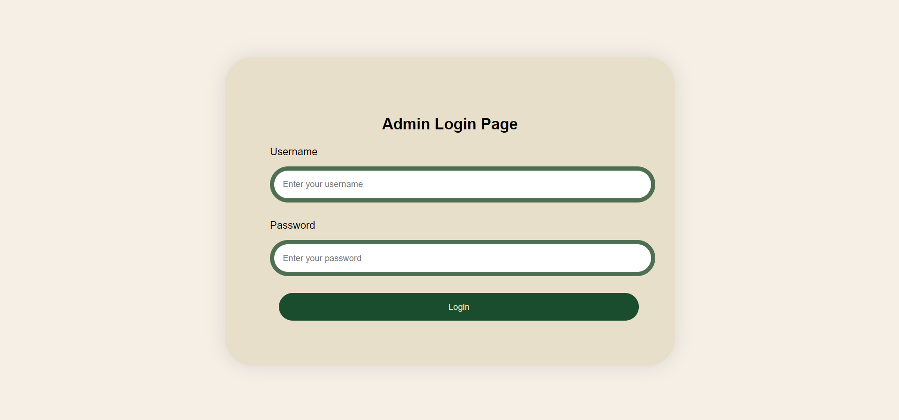
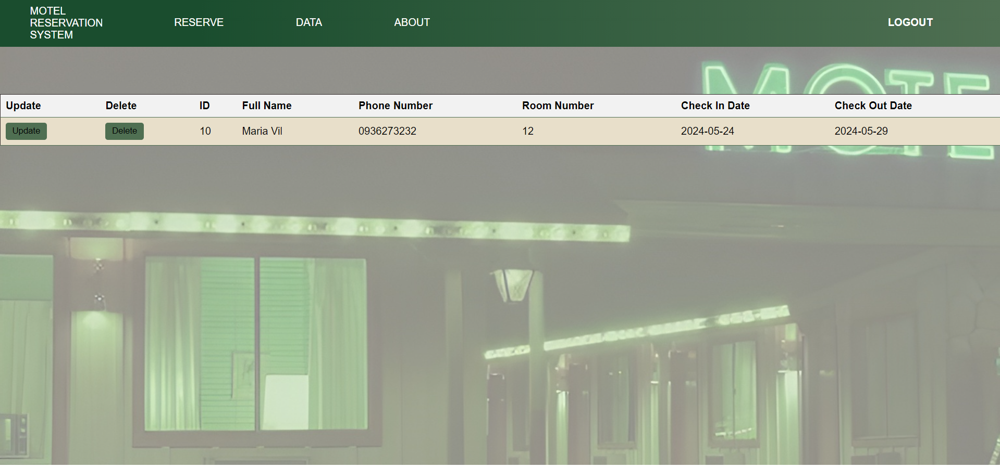
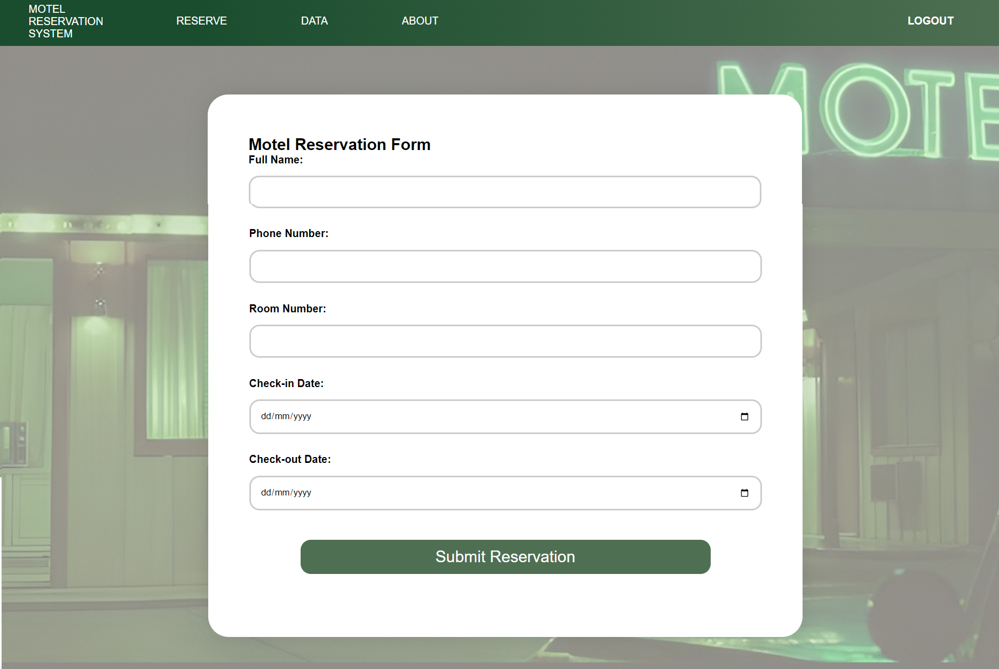
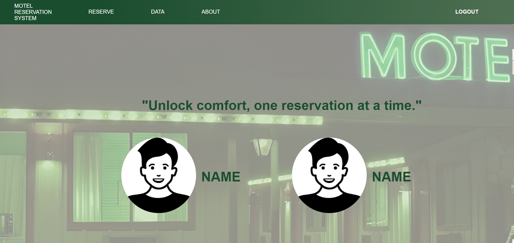

# Motel Reservation System

A simple **Motel Reservation System** built with HTML, CSS, and PHP, designed for managing room reservations. This web application allows users to make, view, update, and delete reservations. The system provides a simple interface for submitting personal details, room preferences, and stay dates.

## Screenshots


*Login Page*


*Data Page*


*Reserve Page*


*About Page*

### Steps to run locally:

1. **Clone the Repository**:
   ```bash
   git clone https://github.com/GlydelD/Motel-Reservation.git
   ```

2. **Set up the Database**:
    - Download or locate the `database.sql` file in the project directory.
    - Open **phpMyAdmin** (or your MySQL client).
    - Create a new database (e.g., `motelReservation`).
    - Import the `database.sql` file into the newly created database.
    - To do this in phpMyAdmin:
      - Click on your newly created database.
      - Go to the "Import" tab.
      - Choose the `database.sql` file and click "Go" to import the structure and data.

3. **Configure Database Connection**:
    - Open `reserveFormDb.php` and edit the MySQL connection details:
      - **hostname**: Usually `localhost`.
      - **username**: Your MySQL username (default is `root`).
      - **password**: Your MySQL password (default is empty for XAMPP/WAMP).
      - **database name**: The name of the database you created in step 2 (e.g., `motelReservation`).

4. **Start the Server**:
    - Launch Apache and MySQL through your local server software (XAMPP, WAMP, or MAMP).
    - Navigate to `localhost/motelReservation` in your browser.

## License

This project is licensed under the MIT License.

